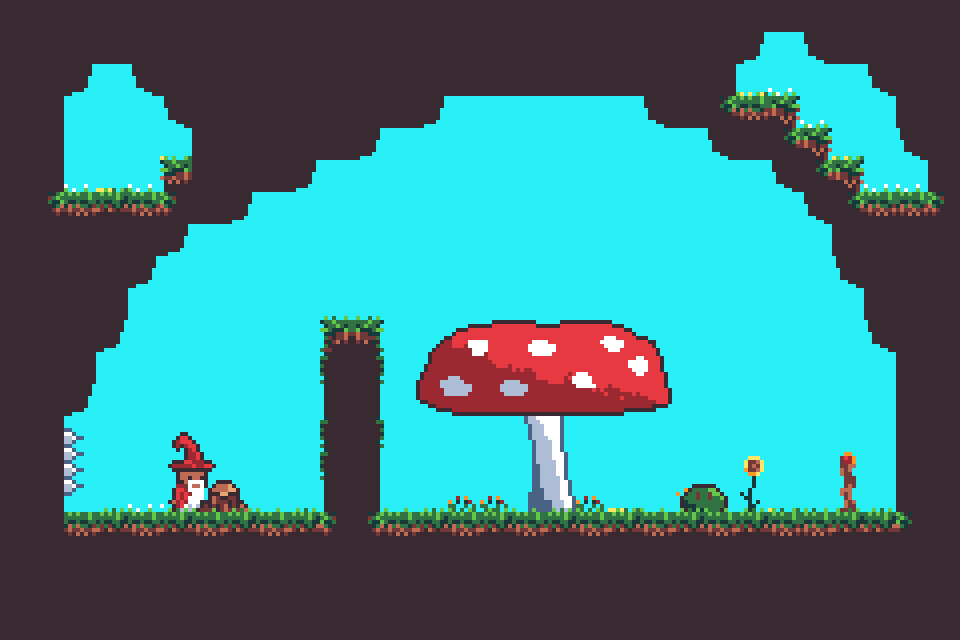

# The Hat Chooses The Wizard

A Game Boy Advance game made for the [GMTK Game jam 2021](https://itch.io/jam/gmtk-2021) written in Rust using the [agb library](https://github.com/corwinkuiper/agb).
Play it at [lostimmortal.itch.io/the-hat-chooses-the-wizard](https://lostimmortal.itch.io/the-hat-chooses-the-wizard).

## Compiling

The [repository for agb](https://github.com/corwinkuiper/agb) gives instructions for what tools are required for using agb.
If you have these, then clone this repository and build away.
If mgba-qt is installed, then a `cargo run` will build and run the game.

## Changes

The code in this repository I will not change apart from changes required to get the code to compile.
Due to being a gamejam game, this comes with all bugs.
We do know of some, and I imagine there are more to be discovered.

